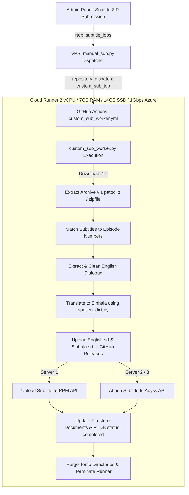

# 💬 AniShift Custom Subtitle Cloud Worker (`anishift-manual-sub-worker`)

[](https://www.python.org/)
[](https://github.com/features/actions)
[](https://wummel.github.io/patool/)
[](https://github.com/tkarabela/pysubs2)
[](https://translate.google.com/)
[](https://firebase.google.com/)

A cloud-native subtitle ingestion and translation pipeline for **AniShift Custom Subtitles**. Extracts bulk ZIP archives, translates dialogue into natural conversational Sinhala, uploads clean `Sinhala.srt` / `English.srt` to GitHub Releases, and attaches subtitles directly to video streams across **Server 1 (RPM)** and **Server 2/3 (Abyss)**.

---

## ⚡ Key Highlights

* **Concurrent Multi-Anime Parallel Execution**:
  * Each incoming subtitle job runs on its own isolated GitHub Actions runner. If an administrator queues 5 anime at once, all 5 run simultaneously in parallel without blocking each other.
* **VPS Zero-Load**:
  * Offloads massive ZIP extraction, line-by-line translation, and network I/O from the VPS to cloud runners (2 vCPU / 7GB RAM / 1Gbps Azure).
* **Multi-Format Archive Handling**:
  * Extracts `.zip`, `.rar`, `.7z`, and `.tar` archives using `patoolib` and `p7zip-full`.
* **Smart Episode Track Association**:
  * Deep filename inspection associates extracted subtitle files with their corresponding anime episode numbers across varying naming styles (e.g. `[Judas] Ep 01`, `S01E05`, `Episode 12`, `#04`).
* **Universal Subtitle Engine & Spoken Sinhala**:
  * Cleans ASS/VTT stylings, ads, vector drawings, and directional Unicode RTL markers.
  * Filters cracked or incomplete tracks using the 125-line threshold.
  * Translates English subtitles to natural Sinhala utilizing the local `spoken_dict.py` vocabulary mapper.
* **Multi-Server Attachment**:
  * Deploys subtitles to **RPMShare API** for Server 1.
  * Deploys subtitles directly to **Abyss.to API** for Server 2 / Server 3 via automatic account discovery.
  * Uploads standalone DDL release assets (`English.srt`, `Sinhala.srt`) to GitHub Releases.
  * Real-time Firestore and RTDB completion status updates.

---

## 🏗️ Architecture Workflow



---

## 🔑 Required GitHub Actions Secrets

Add the following secret keys under your GitHub Repository **Settings -> Secrets and variables -> Actions**:

| Secret Name | Description | Example / Value |
| :--- | :--- | :--- |
| `FIREBASE_JSON` | Full contents of your `serviceAccountKey.json` | `{ "type": "service_account", ... }` |
| `FIREBASE_DB_URL` | Firebase Realtime Database URL | `https://anishift-5d14b-default-rtdb.firebaseio.com/` |
| `RPMSHARE_API_TOKEN` | Server 1 RPMShare API Token | `dea33865f43384df9ae87cd5` |
| `RPMSHARE_API_TOKEN_2` | Server 2 RPMShare API Token | `89b031f1929930a6f8296f61` |
| `SUB_GITHUB_TOKEN` | GitHub Personal Access Token (repo scope for DDL releases) | `ghp_...` |
| `SUB_GITHUB_REPO` | Subtitle Releases Storage Repository | `Anishift-svr/sub-vault-160633` |
| `DEDICATED_RTDB_URL` | Dedicated Server 2 RTDB URL (for Abyss account pooling) | `https://anihsift-sever-2-default-rtdb.firebaseio.com` |

---

## 📁 Repository Structure

```
├── .github/workflows/
│   └── custom_sub_worker.yml   # GitHub Actions cloud runner definition
├── custom_sub_worker.py        # Cloud bulk ZIP processing & translation pipeline
├── sub_engine.py               # Universal subtitle processing and GitHub Release core
├── spoken_dict.py              # Spoken Sinhala dictionary vocabulary mapping
├── proxies.txt                 # Optional network proxy pool
├── requirements.txt            # Python dependencies
└── README.md                   # Documentation
```

---

## 🚀 Running on VPS via PM2

To start the lightweight custom subtitle dispatcher daemon on your VPS:

```bash
# Navigate to custom_sub directory
cd custom_sub

# Start with PM2
pm2 start manual_sub.py --name "Custom-Manual-SubBot" --interpreter python3

# Save PM2 process list
pm2 save
```

---

## 🛡️ License & Credits
Developed exclusively for **AniShift**. All rights reserved.
